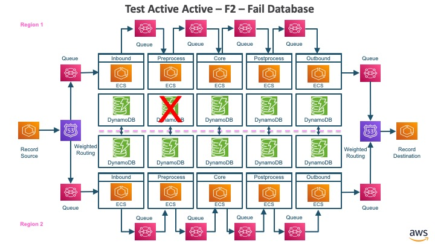
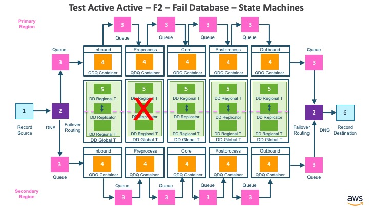

# Active-Active - F2 - Fail Database

## Architecture

The architecture for active-active fail database.

* The record source is a component that publishes records to a DNS target with weighted routing policy
* The in-DNS with weighted routing policy maps to inbound queue in primary region or secondary region based on weighting policy
* The inbound container reads records from inbound queue, writes to inbound aurora global database and publishes to inbound-preprocess queue
* The preprocess container reads records from inbound-preprocess queue, writes to preprocess aurora global database and publishes to preprocess-core queue
* The core container reads records from preprocess-core queue, writes to core dynamodb global table and publishes to core-postprocess queue
* The postprocess container reads records from core-postprocess queue, writes to postprocess aurora global database and publishes to postprocess-outbound queue
* The outbound container reads records from postprocess-outbound queue, writes to outbound global database and publishes to outbound queue
* The out-DNS with failover routing policy maps to outbound queue in primary region or secondary region based on weighting policy
* The record destination is a component that receives records from the DNS target with failover routing policy

## Collaborating State Machines

The collaborating state machines for active-active fail database.

* The record source is represented by an instance of state machine (RecordSourceDNSWeighted) identified as #1
* The in-DNS and out DNS with weighted routing is represented as instances of state machine (Route53DNSWeightedQ) identified as #2
* The queues are represented as instances of state machine (Queue) identified as #3
* The containers are represented as instances of state machine (QAQContainer) identified as #4
* The DynamoDB global tables are represented as instances of state machine (DynamoDBGlobalTable) identified as #5
* The record destination is identified as instance of state machine (RecordDestinationDNSWeighted) identified as #6

## Test Steps

1. Create instances of state machines for all the components and wire them together
2. Create a record set with 3 batches of 10 randomly generated test records each
3. Create Record Source with the record set
4. Initialize the Active-Active Spec with the record set
5. Send event to Record Source to publish the 10 records in 1st batch, and confirm that all the 10 records were successfully processed all the way to the Record Destination
6. Fail the Preprocess Table in region 1
7. Send event to Record Source to publish the 10 records in 2nd batch, and confirm that all the 10 records were successfully delivered to preprocess container
8. Recover the Preprocess Table and Preprocess Container in region 1
9. Send event to Record Source to publish the 10 records in 3rd batch
10. Active-Active Spec will monitor that all the records are delivered to all the components in the architecture and finally delivered to Record Destination

## Key Takeaways:

1. P is an effective language to model the asynchronous distributed system
2. Even though the components in the system are: A) Independent of each other B) Process records at different speeds C) A record could be processed by any one of the components at any point of time, all the records published by the record source are eventually delivered to each component, even though preprocess table was failed when 10 records in the 2nd batch were published. Please note that ordering is not preserved when records are processed independently in two regions.
3. When the preprocess table was failed when 10 records in the 2nd batch were published, the preprocessor container entered dependency failure state upon registering a failure in table, leaving these 10 records pending for processing in inbound-preprocess queue. When the preprocess table and preprocess container were recovered, the container processed the 10 records from 2nd batch from the inbound-preprocess queue that were pending processing, followed by 10 records that were part of 3rd batch.
