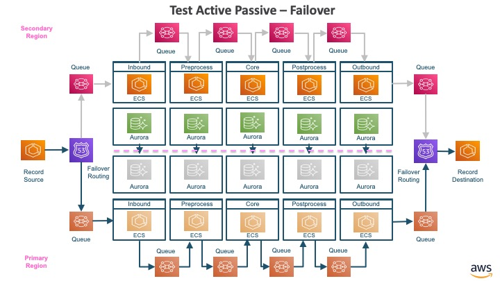
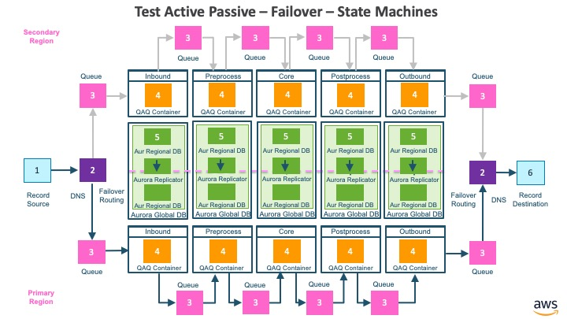

# Active-Passive - Failover

## Architecture 

The architecture for active-passive failover.

* The record source is a component that publishes records to a DNS target with failover routing policy
* The in-DNS with failover routing policy maps to inbound queue in primary region or secondary region based on which region is active
* The inbound container reads records from inbound queue, writes to inbound aurora global database and publishes to inbound-preprocess queue
* The preprocess container reads records from inbound-preprocess queue, writes to preprocess aurora global database and publishes to preprocess-core queue
* The core container reads records from preprocess-core queue, writes to core aurora global database and publishes to core-postprocess queue
* The postprocess container reads records from core-postprocess queue, writes to postprocess aurora global database and publishes to postprocess-outbound queue
* The outbound container reads records from postprocess-outbound queue, writes to outbound global database and publishes to outbound queue
* The out-DNS with failover routing policy maps to outbound queue in primary region or secondary region based on which region is active
* The record destination is a component that receives records from the DNS target with failover routing policy

## Collaborating State Machines

The collaborating state machines for active-passive failover.

* The record source is represented by an instance of state machine (RecordSourceDNSFailover) identified as #1
* The in-DNS and out DNS with failover routing is represented as instances of state machine (Route53DNSFailoverQ) identified as #2
* The queues are represented as instances of state machine (Queue) identified as #3
* The containers are represented as instances of state machine (QAQContainer) identified as #4
* The aurora global databases are represented as instances of state machine (AuroraGlobalDatabase) identified as #5
* The record destination is identified as instance of state machine (RecordDestinationDNSFailover) identified as #6

## Test Steps

1. Create instances of state machines for all the components and wire them together
2. Create a record set with 3 batches of 10 randomly generated test records each
3. Create Record Source with the record set
4. Initialize the Active-Passive Spec with the record set
5. Send event to Record Source to publish the 10 records in 1st batch, and confirm that all the 10 records were successfully processed all the way to the Record Destination
6. Switch the active and passive regions for all the DNS and database components
7. Send events to Record Source to publish the 10 records in 2nd and 3rd batch each
8. Active-Passive Spec will monitor that all the records are delivered in order to all the components in the architecture and finally delivered to Record Destination

## Key Takeaways: 

1. P is an effective language to model the asynchronous distributed system
2. Even though the components in the system are: A) Independent of each other B) Process records at different speeds C) A record could be processed by any one of the components at any point of time, all the records are eventually delivered to each component, including record destination, in the order they were published by the record source
3. Waiting for all the records to be processed after publishing 1st batch of records is important to ensure that in-flight records in the first region are processed successfully, before failing over  to the second region. Otherwise, in flight records in the first region may not be processed  successfully through all the components. This is intuitive, but was confirmed through simulations.
