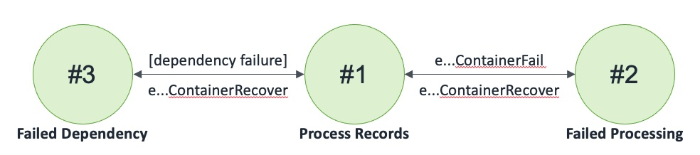

## API Mongo Kafka Container

A Container that receives API requests, writes to an MongoDB Atlas databases, and publishes to Kafka

### States

### Events

1. eAPIMongoKafkaContainer(input: (name: string, region: int, databaseName: string, database: MongoDBAtlas, outKafkaName: string, outKafka: Kafka)
2. eAPIMongoKafkaContainerInvoke: (name: string, region: int, record: tRecord, invoker: machine)
3. eAPIMongoKafkaContainerInvokeCompleted: (name: string, region: int, record: tRecord, success: bool)
4. eAPIMongoKafkaContainerReceiveNotification: (name: string, region: int, count: int, invoker: machine)
5. eAPIMongoKafkaContainerReceiveNotificationResponse: (name: string, region: int, count: int, success: bool)
6. eAPIMongoKafkaContainerSetDatabase: (name: string, region: int, database: MongoDBAtlas, invoker: machine)
7. eAPIMongoKafkaContainerSetDatabaseCompleted: (name: string, region: int, database: MongoDBAtlas, success: bool)
8. eAPIMongoKafkaContainerSetOutKafka: (name: string, region: int, outKafka: Kafka, invoker: machine)
9. eAPIMongoKafkaContainerSetOutKafkaCompleted: (name: string, region: int, outKafka: Kafka, success: bool)
10. eAPIMongoKafkaContainerFail: (name: string, region: int)
11. eAPIMongoKafkaContainerRecover: (name: string, region: int)
12. eAPIMongoKafkaContainerKill: (name: string, region: int)