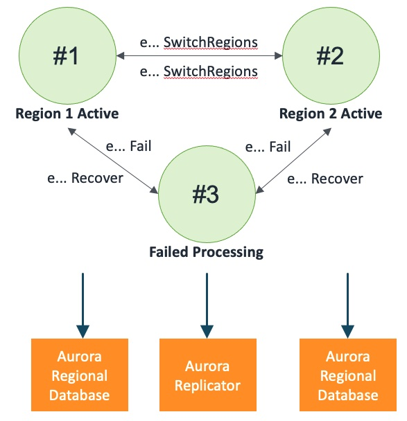

## Aurora Global Database

An Aurora Global Database with two Aurora Regional Databases and a Aurora Replicator

### States

### Events

1. AuroraGlobalDatabase(name: string)
2. eAuroraInsertRecord: (name: string, record: tRecord, invoker: machine)
3. eAuroraInsertRecordCompleted: (name: string, record: tRecord, success: bool)
4. eAuroraUpdateRecord: (name: string, record: tRecord, invoker: machine)
5. eAuroraUpdateRecordCompleted: (name: string, record: tRecord, success: bool)
6. eAuroraDeleteRecord: (name: string, recordId: int, invoker: machine)
7. eAuroraDeleteRecordCompleted: (name: string, recordId: int, success: bool)
8. eAuroraReadRecord: (name: string, recordId: int, invoker: machine)
9. eAuroraReadRecordResponse: (name: string, record: tRecord, success: bool)
10. eAuroraReadRecords: (name: string, recordIds: seq[int], invoker: machine)
11. eAuroraReadRecordsResponse: (name: string, records: seq[tRecord], success: bool)
12. eAuroraGetRecordCount: (name: string, invoker: machine)
13. eAuroraGetRecordCountResponse: (name: string, recordCount: int, success: bool)
14. eAuroraSwitchRegions: (name: string, invoker: machine)
15. eAuroraSwitchRegionsCompleted: (name: string, success: bool)
16. eAuroraFail: (name: string, invoker: machine)
17. eAuroraFailCompleted: (name: string)
18. eAuroraRecover: (name: string)
19. eAuroraKill: (name: string)
20. eAuroraFailReplication: (name: string, invoker: machine)
21. eAuroraFailReplicationCompleted: (name: string)
22. eAuroraRecoverReplication: (name: string)
23. eAuroraCreateReplication: (name: string)
24. eAuroraKillReplication: (name: string)