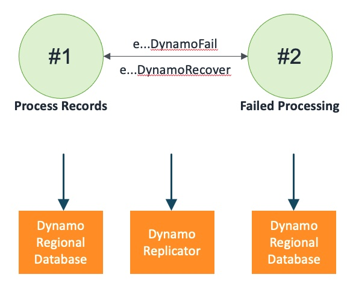

## Dynamo Global Table

A DynamoDB Global Table with two DynamoDB Regional Databases and a DynamoDB Replicator

### States

### Events

1. DynamoGlobalTable(name: string)
2. eDynamoInsertRecord: (name: string, region: int, record: tRecord, invoker: machine)
3. eDynamoInsertRecordCompleted: (name: string, region: int, record: tRecord, success: bool)
4. eDynamoUpdateRecord: (name: string, region: int, record: tRecord, invoker: machine)
5. eDynamoUpdateRecordCompleted: (name: string, region: int, record: tRecord, success: bool)
6. eDynamoDeleteRecord: (name: string, region: int, recordId: int, invoker: machine)
7. eDynamoDeleteRecordCompleted: (name: string, region: int, recordId: int, success: bool)
8. eDynamoReadRecord: (name: string, region: int, recordId: int, invoker: machine)
9. eDynamoReadRecordResponse: (name: string, region: int, record: tRecord, success: bool)
10. eDynamoReadRecords: (name: string, region: int, recordIds: seq[int], invoker: machine)
11. eDynamoReadRecordsResponse: (name: string, region: int, records: seq[tRecord], success: bool)
12. eDynamoGetRecordCount: (name: string, region: int, invoker: machine)
13. eDynamoGetRecordCountResponse: (name: string, region: int, recordCount: int, success: bool)
14. eDynamoFail: (name: string)
15. eDynamoRecover: (name: string)
16. eDynamoKill: (name: string)
17. eDynamoFailReplication: (name: string)
18. eDynamoRecoverReplication: (name: string)
19. eDynamoCreateReplication: (name: string)
20. eDynamoKillReplication: (name: string)