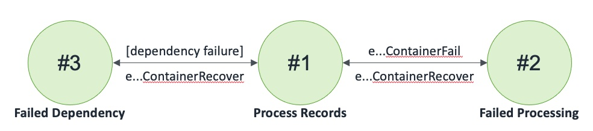

## Kafka Mongo Kafka Container

A Container that reads from Kafka, writes to an MongoDB Atlas databases, and publishes to Kafka

### States

### Events

1. eKafkaMongoKafkaContainer(name: string, region: int, inKafkaName: string, inKafka: Kafka, databaseName: string, database: MongoDBAtlas, outKafkaName: string, outKafka: Kafka)
2. eKafkaMongoKafkaContainerReceiveNotification: (name: string, region: int, count: int, invoker: machine)
3. eKafkaMongoKafkaContainerReceiveNotificationResponse: (name: string, region: int, count: int, success: bool)
4. eKafkaMongoKafkaContainerSetInKafka: (name: string, region: int, inKafka: Kafka, invoker: machine)
5. eKafkaMongoKafkaContainerSetInKafkaCompleted: (name: string, region: int, inKafka: Kafka, success: bool)
6. eKafkaMongoKafkaContainerSetDatabase: (name: string, region: int, database: MongoDBAtlas, invoker: machine)
7. eKafkaMongoKafkaContainerSetDatabaseCompleted: (name: string, region: int, database: MongoDBAtlas, success: bool)
8. eKafkaMongoKafkaContainerSetOutKafka: (name: string, region: int, outKafka: Kafka, invoker: machine)
9. eKafkaMongoKafkaContainerSetOutKafkaCompleted: (name: string, region: int, outKafka: Kafka, success: bool)
10. eKafkaMongoKafkaContainerFail: (name: string, region: int)
11. eKafkaMongoKafkaContainerRecover: (name: string, region: int)
12. eKafkaMongoKafkaContainerKill: (name: string, region: int)