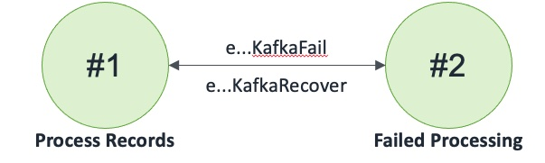

## Kafka

A Kafka stream that an invoker can send records to and receive records from

### States

### Events

1. Kafka(name: string, region: int, batch: int)
2. eKafkaSendRecords: (name: string, region: int, records: seq[tRecord], invoker: machine)
3. eKafkaSendRecordsCompleted: (name: string, region: int, records: seq[tRecord], success: bool)
4. eKafkaReceiveRecords: (name: string, region: int, invoker: machine)
5. eKafkaReceiveRecordsResponse: (name: string, region: int, records: seq[tRecord], kafkaDepth: int, success: bool)
6. eKafkaRemoveRecords: (name: string, region: int, records: seq[tRecord], invoker: machine)
7. eKafkaRemoveRecordsCompleted: (name: string, region: int, records: seq[tRecord], success: bool)
8. eKafkaGetKafkaDepth: (name: string, region: int, invoker: machine)
9. eKafkaGetKafkaDepthResponse: (name: string, region: int, kafkaDepth: int, success: bool)
10. eKafkaReceiveNotification: (name: string, region: int, count: int, invoker: machine)
11. eKafkaReceiveNotificationResponse: (name: string, region: int, count: int, success: bool)
12. eKafkaFail: (name: string, region: int, invoker: machine)
13. eKafkaFailCompleted: (name: string, region: int)
14. eKafkaRecover: (name: string, region: int)
15. eKafkaKill: (name: string, region: int)