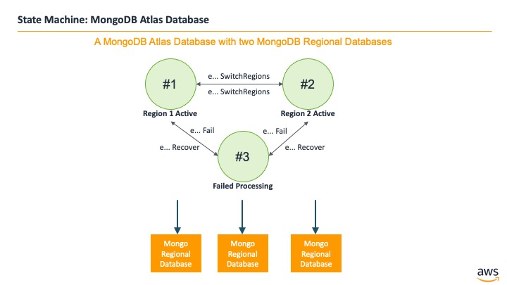

## MongoDB Atlas Database

A MongoDB Atlas Database with two MongoDB Regional Databases

### States

### Events

1. MongoDBAtlas(name: string)
2. eMongoInsertRecord: (name: string, region: int, record: tRecord, invoker: machine)
3. eMongoInsertRecordCompleted: (name: string, region: int, record: tRecord, success: bool)
4. eMongoUpdateRecord: (name: string, region: int, record: tRecord, invoker: machine)
5. eMongoUpdateRecordCompleted: (name: string, region: int, record: tRecord, success: bool)
6. eMongoDeleteRecord: (name: string, region: int, recordId: int, invoker: machine)
7. eMongoDeleteRecordCompleted: (name: string, region: int, recordId: int, success: bool)
8. eMongoReadRecord: (name: string, region: int, recordId: int, invoker: machine)
9. eMongoReadRecordResponse: (name: string, region: int, record: tRecord, success: bool)
10. eMongoReadRecords: (name: string, region: int, recordIds: seq[int], invoker: machine)
11. eMongoReadRecordsResponse: (name: string, region: int, records: seq[tRecord], success: bool)
12. eMongoGetRecordCount: (name: string, region: int, invoker: machine)
13. eMongoGetRecordCountResponse: (name: string, region: int, recordCount: int, success: bool)
14. eMongoFail: (name: string)
15. eMongoRecover: (name: string)
16. eMongoKill: (name: string)