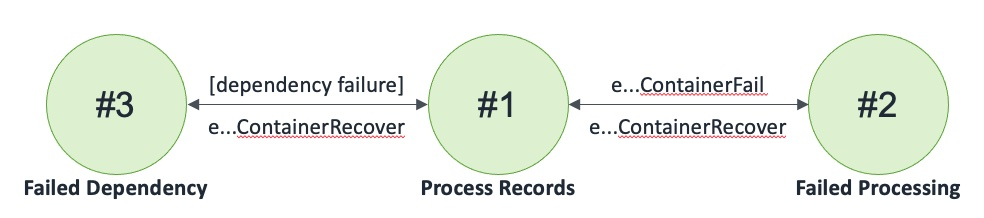

## Queue Aurora Queue Container

A Container that reads from a queue, writes to an Aurora global database, and publishes to a queue

### States

### Events

1. QueueAuroraQueueContainer(name: string, region: int, inQueueName: string, inQueue: Queue, databaseName: string, database: AuroraGlobalDatabase, outQueueName: string, outQueue: Queue)
2. eQueueAuroraQueueContainerReceiveNotification: (name: string, region: int, count: int, invoker: machine)
3. eQueueAuroraQueueContainerReceiveNotificationResponse: (name: string, region: int, count: int, success: bool)
4. eQueueAuroraQueueContainerSetInQueue: (name: string, region: int, inQueue: Queue, invoker: machine)
5. eQueueAuroraQueueContainerSetInQueueCompleted: (name: string, region: int, inQueue: Queue, success: bool)
6. eQueueAuroraQueueContainerSetDatabase: (name: string, region: int, database: AuroraGlobalDatabase, invoker: machine)
7. eQueueAuroraQueueContainerSetDatabaseCompleted: (name: string, region: int, database: AuroraGlobalDatabase, success: bool)
8. eQueueAuroraQueueContainerSetOutQueue: (name: string, region: int, outQueue: Queue, invoker: machine)
9. eQueueAuroraQueueContainerSetOutQueueCompleted: (name: string, region: int, outQueue: Queue, success: bool)
10. eQueueAuroraQueueContainerFail: (name: string, region: int)
11. eQueueAuroraQueueContainerRecover: (name: string, region: int)
12. eQueueAuroraQueueContainerKill: (name: string, region: int)