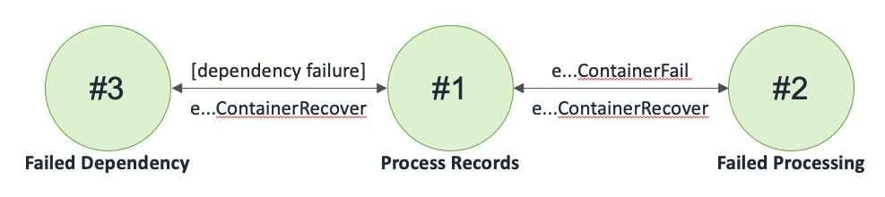

## Queue Dynamo Queue Container

A Container that reads from a queue, writes to a Dynamo global table, and publishes to a queue

### States

### Events

1. QueueDynamoQueueContainer(name: string, region: int, inQueueName: string, inQueue: Queue, tableName: string, table: DynamoGlobalTable, outQueueName: string, outQueue: Queue)
2. eQueueDynamoQueueContainerReceiveNotification: (name: string, region: int, count: int, invoker: machine)
3. eQueueDynamoQueueContainerReceiveNotificationResponse: (name: string, region: int, count: int, success: bool)
4. eQueueDynamoQueueContainerSetInQueue: (name: string, region: int, inQueue: Queue, invoker: machine)
5. eQueueDynamoQueueContainerSetInQueueCompleted: (name: string, region: int, inQueue: Queue, success: bool)
6. eQueueDynamoQueueContainerSetTable: (name: string, region: int, table: DynamoGlobalTable, invoker: machine)
7. eQueueDynamoQueueContainerSetTableCompleted: (name: string, region: int, table: DynamoGlobalTable, success: bool)
8. eQueueDynamoQueueContainerSetOutQueue: (name: string, region: int, outQueue: Queue, invoker: machine)
9. eQueueDynamoQueueContainerSetOutQueueCompleted: (name: string, region: int, outQueue: Queue, success: bool)
10. eQueueDynamoQueueContainerFail: (name: string, region: int)
11. eQueueDynamoQueueContainerRecover: (name: string, region: int)
12. eQueueDynamoQueueContainerKill: (name: string, region: int)