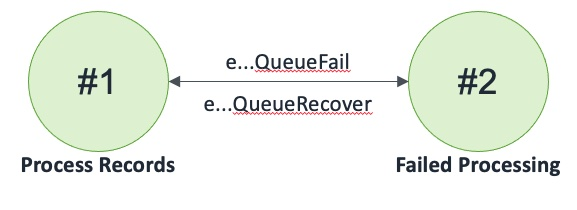

## Queue

A Queue that an invoker can send records to and receive records from

### States

### Events

1. Queue(name: string, region: int)
2. eQueueSendRecord: (name: string, region: int, record: tRecord, invoker: machine)
3. eQueueSendRecordCompleted: (name: string, region: int, record: tRecord, success: bool)
4. eQueueReceiveRecord: (name: string, region: int, invoker: machine)
5. eQueueReceiveRecordResponse: (name: string, region: int, record: tRecord, queueDepth: int, success: bool)
6. eQueueRemoveRecord: (name: string, region: int, record: tRecord , invoker: machine)
7. eQueueRemoveRecordCompleted: (name: string, region: int, record: tRecord, success: bool)
8. eQueueGetQueueDepth: (name: string, region: int, invoker: machine)
9. eQueueGetQueueDepthResponse: (name: string, region: int, queueDepth: int, success: bool)
10. eQueueReceiveNotification: (name: string, region: int, count: int, invoker: machine)
11. eQueueReceiveNotificationResponse: (name: string, region: int, count: int, success: bool)
12. eQueueFail: (name: string, region: int, invoker: machine)
13. eQueueFailCompleted: (name: string, region: int)
14. eQueueRecover: (name: string, region: int)
15. eQueueKill: (name: string, region: int)