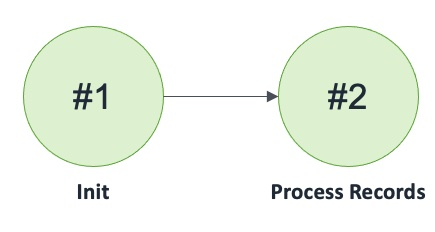

## Record Destination DNS Failover Queue

Receives records from Route 53 DNS configured to route to Queues with Failover routing policy

### States

### Events

1. RecordDestinationDNSFailoverQueue(name: string, region: int, dnsName: string, dns: Route53DNSFailoverQueue)
2. eRecordDestinationDNSFailoverQueueReceiveNotification: (name: string, region: int, count: int, invoker: machine)
3. eRecordDestinationDNSFailoverQueueReceiveNotificationResponse: (name: string, region: int, count: int)
4. eRecordDestinationDNSFailoverQueueResume: (name: string)
