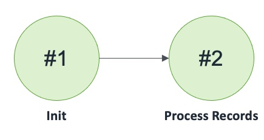

## Record Destination DNS Weighted Queue

Receives records from Route 53 DNS configured to route to Queues with Weighted routing policy

### States

### Events

1. RecordDestinationDNSWeightedQueue(name: string, region: int, dnsName: string, dns: Route53DNSWeightedQueue)
2. eRecordDestinationDNSWeightedQueueReceiveNotification: (name: string, region: int, count: int, invoker: machine)
3. eRecordDestinationDNSWeightedQueueReceiveNotificationResponse: (name: string, region: int, count: int)
4. eRecordDestinationDNSWeightedQueueResume: (name: string)
