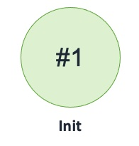

## Record Source DNS Failover Queue

Publishes records to Route 53 DNS configured to route to Queues with Failover routing policy 

### States

### Events

1. RecordSourceDNSFailoverQueue(name: string, region: int, dnsName: string, dns: Route53DNSFailoverQueue, records: seq[seq[tRecord]]
2. eRecordSourceDNSFailoverQueueGenerateRecords: (name: string, region: int, batch: int, invoker: machine)
3. eRecordSourceDNSFailoverQueueGenerateRecordsNotification: (name: string, region: int, batch: int, count: int)
