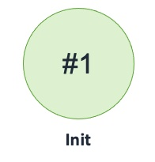

## Record Source DNS Weighted API

Publishes records to Route 53 DNS configured to route to APIs with Weighted routing policy

### States

### Events

1. RecordSourceDNSWeightedAPI(name: string, region: int, dnsName: string, dns: Route53DNSWeightedAPI, records: seq[seq[tRecord]])
2. eRecordSourceDNSWeightedAPIGenerateRecords: (name: string, region: int, batch: int, invoker: machine)
3. eRecordSourceDNSWeightedAPIGenerateRecordsNotification: (name: string, region: int, batch: int, count: int)
