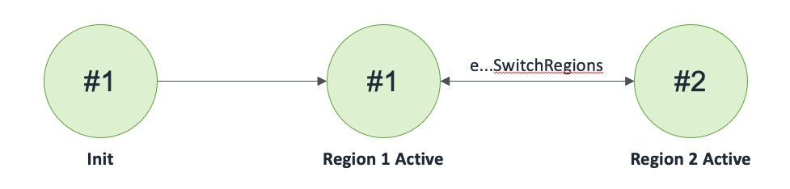

## Route 53 DNS Failover Queue

Route 53 DNS configured to route to Queues with Failover routing policy

### States

### Events

1. Route53DNSFailoverQueue(name: string, queue1Name: string, queue1: Queue, queue2Name: string, queue2: Queue)
2. eRoute53DNSFailoverQueueSendRecord: (name: string, record: tRecord, invoker: machine)
3. eRoute53DNSFailoverQueueSendRecordCompleted: (name: string, record: tRecord, success: bool)
4. eRoute53DNSFailoverQueueReceiveRecord: (name: string, invoker: machine)
5. eRoute53DNSFailoverQueueRemoveRecord: (name: string, record: tRecord, invoker: machine)
6. eRoute53DNSFailoverQueueRemoveRecordCompleted: (name: string, record: tRecord, success: bool)
7. eRoute53DNSFailoverQueueSwitchRegions: (name: string)
8. eRoute53DNSFailoverQueueSetQueue1: (name: string, region: int, queue1: Queue, invoker: machine)
9. eRoute53DNSFailoverQueueSetQueue1Completed: (name: string, region: int, queue1: Queue, success: bool);
10. eRoute53DNSFailoverQueueSetQueue2: (name: string, region: int, queue2: Queue, invoker: machine)
11. eRoute53DNSFailoverQueueSetQueue2Completed: (name: string, region: int, queue2: Queue, success: bool)
