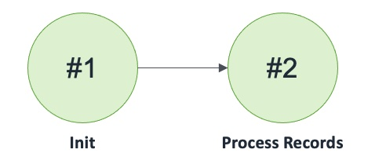

## Route 53 DNS Weighted API

Route 53 DNS configured to route to Queues with Weighted routing policy

### States

### Events

1. Route53DNSWeightedAPI(name: string, api1Name: string, api1: APIMongoAPIContainer, api2Name: string, api2: APIMongoAPIContainer)
2. eRoute53DNSWeightedAPISendRecord: (name: string, record: tRecord, invoker: machine)
3. eRoute53DNSWeightedAPISendRecordCompleted: (name: string, record: tRecord, success: bool)
4. eRoute53DNSWeightedAPISwitchRegionOffline : (name: string, region: int)
5. eRoute53DNSWeightedAPISetAPI1: (name: string, region: int, api1: APIMongoAPIContainer, invoker: machine)
6. eRoute53DNSWeightedAPISetAPI1Completed: (name: string, region: int, api1: APIMongoAPIContainer, success: bool)
7. eRoute53DNSWeightedAPISetAPI2: (name: string, region: int, api2: APIMongoAPIContainer, invoker: machine)
8. eRoute53DNSWeightedAPISetAPI2Completed: (name: string, region: int, api2: APIMongoAPIContainer, success: bool)