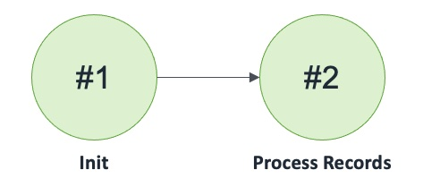

## Route 53 DNS Weighted Queue

Route 53 DNS configured to route to Queues with Weighted routing policy

### States

### Events

1. Route53DNSWeightedQueue(name: string, queue1Name: string, queue1: Queue, queue2Name: string, queue2: Queue)
2. eRoute53DNSWeightedQueueSendRecord: (name: string, record: tRecord, invoker: machine)
3. eRoute53DNSWeightedQueueSendRecordCompleted: (name: string, record: tRecord, success: bool)
4. eRoute53DNSWeightedQueueReceiveRecord: (name: string, region: int, invoker: machine)
5. eRoute53DNSWeightedQueueRemoveRecord: (name: string, region: int, record: tRecord, invoker: machine)
6. eRoute53DNSWeightedQueueRemoveRecordCompleted: (name: string, region: int, record: tRecord, success: bool)
7. eRoute53DNSWeightedQueueSwitchRegionOffline : (name: string, region: int)
8. eRoute53DNSWeightedQueueSetQueue1: (name: string, region: int, queue1: Queue, invoker: machine)
9. eRoute53DNSWeightedQueueSetQueue1Completed: (name: string, region: int, queue1: Queue, success: bool);
10. eRoute53DNSWeightedQueueSetQueue2: (name: string, region: int, queue2: Queue, invoker: machine)
11. eRoute53DNSWeightedQueueSetQueue2Completed: (name: string, region: int, queue2: Queue, success: bool)