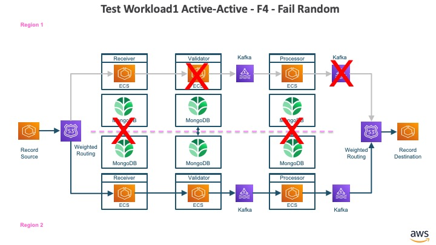
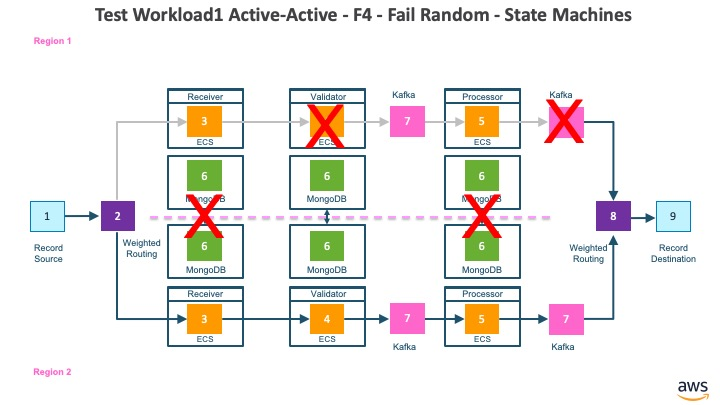

# Workload1 - F4 - Fail Random Components

## Architecture

The architecture for workload1 fail random components.

* The record source is a component that publishes records to a DNS target with weighted routing policy
* The in-DNS with weighted routing policy maps to receiver API in primary region or secondary region based on weighting policy
* The receiver API writes to receiver MongoDB Atlas database and invokes validator API
* The validator API writes to validator MongoDB Atlas database and publishes to inbound Kafka for processor container
* The processor container reads records from inbound Kafka stream, writes to MongoDB Atlas database and publishes to outbound Kafka stream
* The out-DNS with failover routing policy maps to outbound Kafka in primary region or secondary region based on weighting policy
* The record destination is a component that receives records from the DNS target with failover routing policy

## Collaborating State Machines

The collaborating state machines for workload1 fail random components.

* The record source is represented by an instance of state machine (RecordSourceDNSWeightedAPI) identified as #1
* The in-DNS with weighted routing is represented by an instance of state machine (Route53DNSWeightedAPI) identified as #2
* The receiver container is represented by an instance of state machine (APIMongoAPIContainer) identified as #3
* The validator container is represented by an instance of state machine (APIMongoKafkaContainer) identified as #4
* The processor container is represented by an instance of state machine (KafkaMongoKafkaContainer) identified as #5
* The MongoDB Atlas databases are represented as instances of state machine (MongoDBAtlas) identified as #6
* The Kafka streams are represented as instances of state machine (Kafka) identified as #7
* The out-DNS with weighted routing is represented as instances of state machine (Route53DNSWeightedKafka) identified as #8
* The record destination is identified as instance of state machine (RecordDestinationDNSWeightedKafka) identified as #9

## Test Steps

1. Create instances of state machines for all the components and wire them together
2. Create a record set with 3 batches of 50 randomly generated test records each
3. Create Record Source with the record set
4. Initialize the Workload1 Spec with the record set
5. Send event to Record Source to publish the 50 records in 1st batch, and confirm that all the 50 records were successfully processed all the way to the Record Destination
6. Fail a random number of components and random instances of components in region 1
7. Send event to Record Source to publish the 50 records in 2nd batch, and confirm that all the 50 records were successfully published by the record source
8. Recover all the components failed in step #6
9. Send event to Record Source to publish the 50 records in 3rd batch
10. Workload1 Spec will monitor that all the records are delivered to all the components in the architecture and finally delivered to Record Destination

## Key Takeaways

1. P is an effective language to model the asynchronous distributed system
2. Even though the components in the system are: A) Independent of each other B) Process records at different speeds C) A record could be processed by any one of the components at any point of time, all the records published by the record source are eventually delivered to each component, even though a random number of components and random instances of components were failed before 50 records in the 2nd batch were published. Please note that ordering is not preserved when records are processed independently in two regions.
3. When components are failed at random and 50 records in the 2nd batch are published, these 50 records are left pending for processing. When those failed components are recovered they process the 50 records from 2nd batch that were pending processing, followed by 50 records that were part of 3rd batch.
4. The most important thing to note here is that even a random number of components and random instances of components are failed and recovered, it did not require any replay